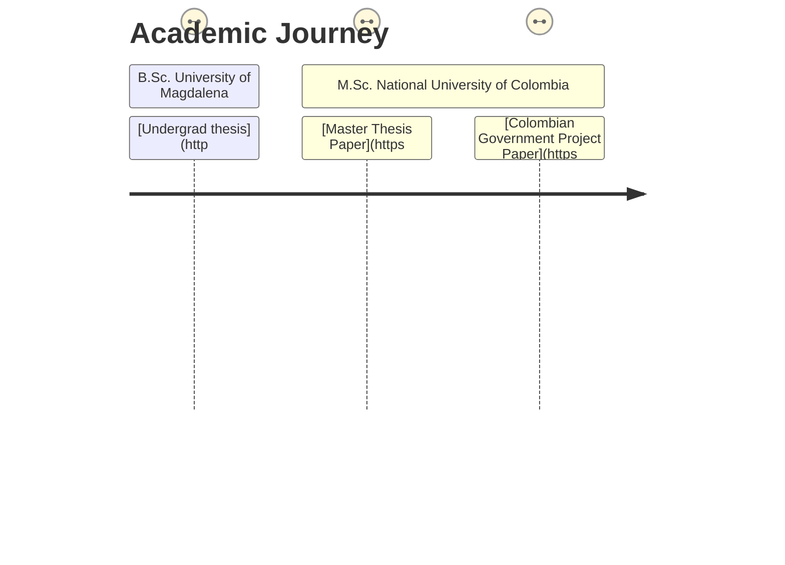

<h3 align="center">
    <samp>  Hello! :wave: I am
            <b><a target="_blank" href="https://camilolaiton.github.io/portfolio/">Camilo Laiton</a></b>
    :colombia:
    </samp>
</h3>

  <samp style="font-weight:550;font-style: italic">
    <ul>
        <li> :computer: Computer Vision Engineer at the <a href="https://alleninstitute.org/division/neural-dynamics/">Allen Institute for Neural Dynamics</a>.</li>
        <li> :mortar_board: M.Sc. <a href="https://medellin.unal.edu.co/">National University of Colombia</a></li>
        <li> :octocat: Currently working on image processing cloud pipelines for light-sheet microscope images, semantic segmentation and image processing evaluation.</li>
    </ul>
  </samp> 
  
  <samp style="font-weight:550"> :city_sunset: Seattle, WA.</samp>  

  
  
  
  

